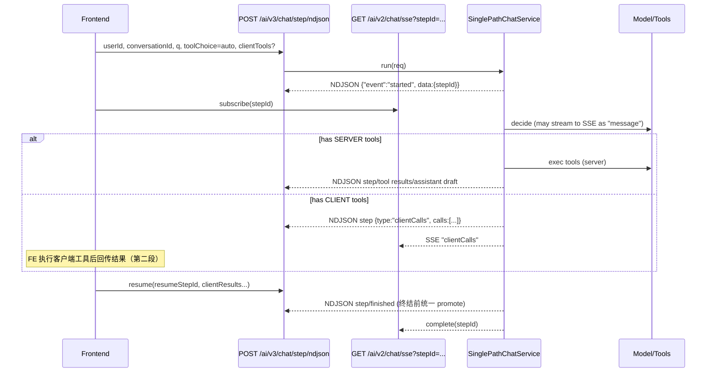

# JavelinAI SDK — Orchestrated Chat (NDJSON + SSE)

A **Java 21 / Spring Boot WebFlux** backend with a modern React console that demonstrates an **auditable, two‑stage tool‑calling chat orchestration**:

- Stage A: **NDJSON** endpoint returns *step events* (started/step/finished/error).
- Stage B: **SSE** channel mirrors decision/streamed tokens and clientCalls so the UI can keep rendering live.

> 目标：可回放、可审计、可治理（幂等、去重、热禁用）的一体化编排样板。

---

## ✨ Highlights

- **单路径编排循环**：`SinglePathChatService` 统一驱动“决策 → 工具 → 续写/等待客户端 → 终结”。
- **两段式输出**：
  - `POST /ai/v3/chat/step/ndjson` → NDJSON 行式事件（第一段）。
  - `GET  /ai/v2/chat/sse?stepId=...` → SSE 实时流（第二段）。
- **客户端工具对账**：后端强校验 `resumeStepId ↔ userId/conversationId`，以及 `clientResults.tool_call_id` 必须来自该 step 下发。
- **工具执行治理**：去重账本、缓存复用、运行时禁用（toggle），并把 `userId/conversationId` 注入入账维度。
- **审计与存储**：支持数据库与内存两种 memory；数据库模式带 **hash 链** 审计（`audit/*`）。
- **热配置**：`/admin/config` 合并/替换两种更新模式；`EffectiveProps` 统一读取“静态+运行时”配置。

---

## 🧭 Repository Layout

```
apps/
  backend/                       # Spring Boot (WebFlux + MyBatis)
    src/main/java/com/example/
      controller/
        OrchestratedChatController.java      # NDJSON 统一接口
        StreamController.java                # SSE 接口
        AdminController.java                 # 运行时配置查看/更新
      service/
        SinglePathChatService.java           # 主循环（编排引擎）
        impl/
          DecisionServiceSpringAi.java       # 决策（非流 / 流式转发）
          ContinuationServiceImpl.java       # 写入工具结果并续写
          DefaultClientResultIngestor.java   # 吸收客户端工具结果
          DatabaseConversationMemoryService  # 数据库存储 + 审计链
          InMemoryConversationMemoryService  # 内存存储（开发便捷）
          StepContextStore.java              # step 级状态/对账
      infra/
        StepSseHub.java                      # SSE 心跳/TTL/清理
        FinalAnswerStreamManager.java        # token/工具增量聚合与转发
      tools/                                 # 工具接口与实现（web_search/web_fetch/python_exec...）
      config/                                # 配置项、热配置聚合、WebClient 等
      api/dto/                               # ChatRequest / StepEvent / ToolCall / ToolResult...
    src/main/resources/
      application.yaml                       # 主要配置
      com/example/mapper/*.xml               # MyBatis 映射
  console/                                   # Vite + React + TypeScript (演示/控制台)
    src/pages/NdjsonSseDemoPage.tsx          # 最小可复现页面（NDJSON+SSE）
    src/pages/StepOrchestratorPage.tsx       # 编排台（发送/继续、对账、查看 clientCalls）
  frontend/                                  # 另一套简洁聊天 UI 示例
```

---

## 🚀 Quick Start

### Requirements
- Java 21, Maven 3.9+
- Node.js 20+，包管理器任选（pnpm / npm / yarn）
- 可选：MySQL（如需持久化与审计链）

### 1) Run backend

```bash
cd apps/backend
# 配置必要环境变量（视模式而定）
# OPENAI_API_KEY=...
# SERPER_API_KEY=...         # web_search 用
# OLLAMA_BASE_URL=...        # 如走本地模型
# spring.ai.openai.base-url=https://api.openai.com  # 用官方 OpenAI 时建议显式设置

mvn spring-boot:run
# 服务默认 http://localhost:8080
```

> ⚠️ 注意：示例 `application.yaml` 给 `spring.ai.openai.base-url` 的默认值可能指向本地（便于代理/调试）。
> 真连 OpenAI 官方时请改为官方地址，或通过环境变量覆盖。

### 2) Run console (演示/控制台)

```bash
cd apps/console
pnpm i      # 或 npm i / yarn
pnpm dev    # http://localhost:5173（默认）
```

- 打开 **NdjsonSseDemoPage** / **StepOrchestratorPage**，即可串起 **NDJSON + SSE** 的两段式流程。

### 3) (可选) Run minimal frontend

```bash
cd apps/frontend
pnpm i
pnpm dev
```

---

## ⚙️ Configuration (关键片段)

`apps/backend/src/main/resources/application.yaml`：

```yaml
server:
  port: 8080

ai:
  mode: OPENAI                # OPENAI | OLLAMA
  model: qwen3:8b
  stepjson:
    heartbeat-seconds: 5
  think:
    enabled: true

  tools:
    max-loops: 10
    dedup:
      enabled: true
      ttl-minutes: 30
      maximum-size: 10000

    web-search:
      provider: serper
      serper:
        base-url: https://google.serper.dev
        api-key: ${SERPER_API_KEY}
        timeout: 8s
      defaults:
        top-k: 5
        lang: zh-CN
        country: jp
        safe: true

    web-fetch:
      allowed-schemes: [http, https]
      timeout: 8s
      max-in-memory-bytes: 524288
      default-max-chars: 2000
      user-agent: JavelinAI-WebFetch/1.0
      ssrf-guard-enabled: true

sse:
  heartbeat-every: PT20S
  step-ttl: PT10M
  janitor-every: PT60S

spring:
  ai:
    openai:
      api-key: ${OPENAI_API_KEY:dummy}
      base-url: ${OPENAI_BASE_URL:http://localhost:11434}
    ollama:
      base-url: ${OLLAMA_BASE_URL:http://localhost:11434}

logging:
  level:
    com.example: DEBUG
```

**运行时热配置**（由 `/admin/config` 提供）会覆盖部分静态配置：
- `compatibility`（OPENAI/OLLAMA）、`model`、`toolsMaxLoops`
- `toolToggles`（按名称禁用/启用某个工具）
- `baseUrl`、`apiKey`、`clientTimeoutMs`、`streamTimeoutMs`、`memoryMaxMessages`

---

## 🧠 Orchestration Flow（两段式）



---

## 🧪 API Quick Reference

### 1) Start (第一段)

`POST /ai/v3/chat/step/ndjson`  (Content-Type: `application/json`, Produces: `application/x-ndjson`)

**Request (示例)**
```json
{
  "userId": "u1",
  "conversationId": "c1",
  "q": "给我总结 OpenAI 最新价格",
  "toolChoice": "auto",
  "responseMode": "step-json-ndjson",
  "clientTools": [
    {
      "type": "function",
      "function": {
        "name": "open_url",
        "description": "open a url in browser",
        "parameters": {
          "type": "object",
          "properties": { "url": { "type": "string" } },
          "required": ["url"]
        }
      }
    }
  ]
}
```

**NDJSON 可能行**（节选）
```json
{"event":"started","ts":"...","data":{"stepId":"step-...","loop":0}}
{"event":"step","ts":"...","data":{"type":"clientCalls","stepId":"step-...","calls":[{"id":"call_...","function":{"name":"open_url","arguments":"{\"url\":\"https://...\"}"}}]}}
```

### 2) SSE 观察（可在第一段开始后立即订阅）

`GET /ai/v2/chat/sse?stepId=step-...`  (text/event-stream)

> 将收到 `"message"`（LLM 流式 token 或决策片段）与 `"clientCalls"` 等事件。

### 3) Continue / Resume (第二段)

`POST /ai/v3/chat/step/ndjson`

**Request (示例)** —— 注意 `tool_call_id` 必须匹配第一段下发的 callId：
```json
{
  "userId": "u1",
  "conversationId": "c1",
  "resumeStepId": "step-...",
  "toolChoice": "auto",
  "responseMode": "step-json-ndjson",
  "clientResults": [
    {
      "tool_call_id": "call_abc123",
      "name": "open_url",
      "status": "ok",
      "payload": { "type":"text", "value":"页面已打开，抓到定价：..." },
      "args": { "url": "https://..." }
    }
  ]
}
```

**响应**：继续返回 NDJSON 直到 `{"event":"finished",...}`，**终结前会统一将本 step 草稿 promote 为 FINAL**。

---

## 🧩 Tools (示例)

- `web_search`：Serper.dev（news/web/images）；默认 `top_k=5`，`lang=zh-CN`，`country=jp`。
- `web_fetch`：带 **SSRF 守卫**、`max-in-memory-bytes`、`default-max-chars`、`user-agent` 可配。
- `python_exec`：可限制超时、输出字节、是否允许 pip、是否使用 Docker 沙箱等。

工具形态对齐 OpenAI function-calling：
```json
{
  "type": "function",
  "function": {
    "name": "web_search",
    "parameters": { "type": "object", "properties": { "q": { "type":"string" } } }
  }
}
```

运行时可通过 `/admin/config` 的 `toolToggles` **禁用** 单个工具：
```json
{
  "toolToggles": {
    "web_search": false,
    "python_exec": true
  }
}
```

---

## 🧱 Memory & Audit

- **存储选择**：
  - `InMemoryConversationMemoryService`（默认，开发友好）
  - `DatabaseConversationMemoryService`（`ai.memory.storage=database` 时生效）
- **数据库模式**：
  - 所有消息以 `DRAFT/FINAL` 写入，**在 step 终结时统一 promote**。
  - 审计链（`audit/*`）对消息做 canonical 化与哈希链，便于复核与导出。
- **注意**：当前内存模式下 `getContext(user, conv, stepId, limit)` 尚未实现（返回空）。如需用内存模式完整上下文，请补齐该实现或切到数据库模式。

---

## 🛠 Admin Runtime Config

- `GET  /admin/config`：查看运行时配置（已打码的 apiKey + Effective 合并结果 + 可用工具列表）。
- `PUT  /admin/config`：**合并语义**更新（只更新传入字段，`toolToggles` 显式传入{}可清空；未传则保留）。
- `PUT  /admin/config/replace`：**全量替换**（未传字段将被清空）。

---

## 🔐 Security Notes

- `web_fetch` 带基础 **SSRF 防护**（限制方案/回环/链路本地等）；建议生产环境配合网关层出网白名单。
- 对 `resumeStepId` 与 `clientResults.tool_call_id` 做了严格对账，避免跨会话/跨 step 注入。

---

## 🧰 Troubleshooting

- **SSE 看不到事件**：确认已先从 NDJSON 拿到 `stepId`，并用相同 `stepId` 订阅；检查 `sse.step-ttl` 是否过短。
- **决策流没 token**：`EffectiveProps.streamDecision()` 可热开关；同时确认模型/代理是否支持流。
- **OPENAI 模式连本地**：检查 `spring.ai.openai.base-url`，如需官方请显式设置为 `https://api.openai.com`。
- **clientResults 被拒**：检查 `resumeStepId` 是否来自本次 NDJSON 的 `started`；`tool_call_id` 是否属于该 step 下发的 `clientCalls`。

---

## 📜 License

选择并填写你的开源许可证（MIT/Apache-2.0 等）。

---

## 🤝 Contributing

欢迎提交 Issue/PR。建议在 PR 描述中附：
- 改动点及动机
- 端到端测试步骤（NDJSON + SSE）
- 是否涉及工具/审计/热配置变化
